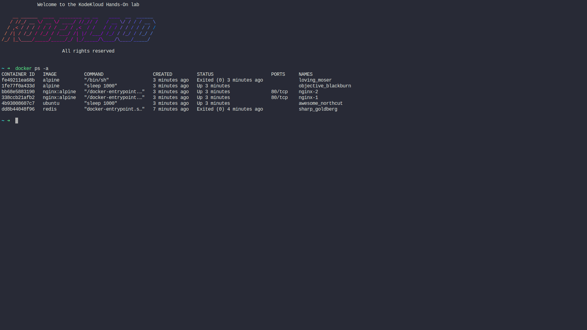
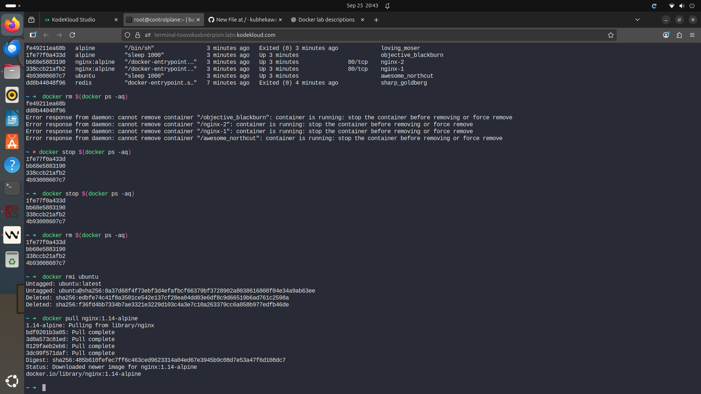
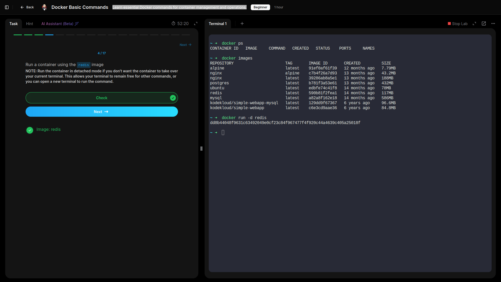
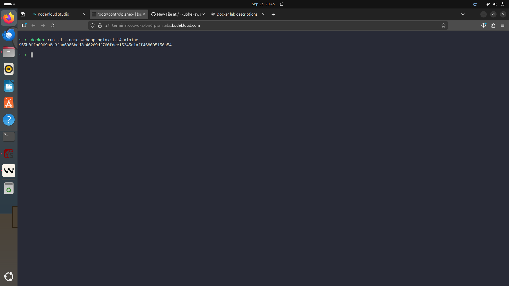
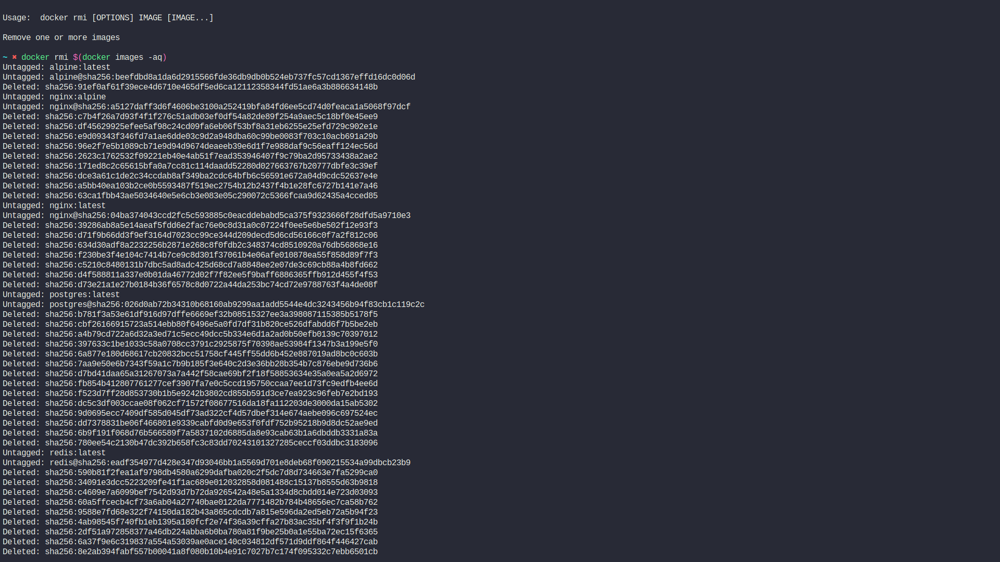

# Docker Basic Commands 

- **Learned essential Docker commands for container management and operations.**

## Commands Used.
```
docker --version            # check docker version.
docker ps                   # list containers running on docker.
docker images               # list all images available.
docker run -d <image_name>  # run an image in detached mode.
docker stop <container_id>  # stop running container.
docker ps -a                # list all  present containers.
docker rm $(docker ps -aq)  # delete all containers.
docker rmi <image_name>     # delete an existing image.
dokcer pull <image_name>    # pulls image
```
---


- **Listed Containers currently in docker.**


- **Pulled an Image.**


- **Created  Containers from pulled images.**



- **Removed all images in Docker.**


