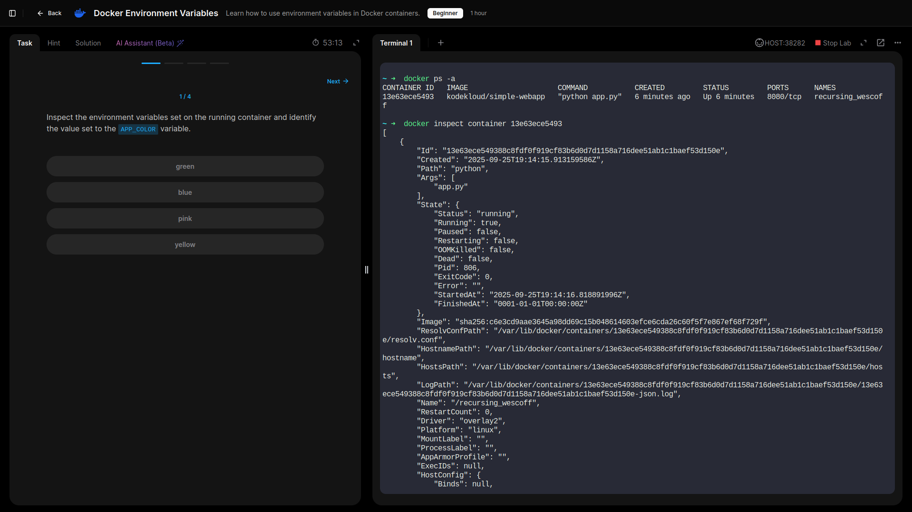
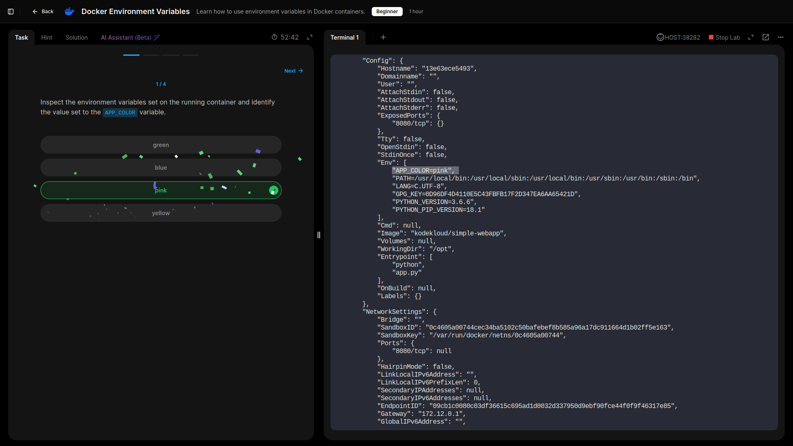
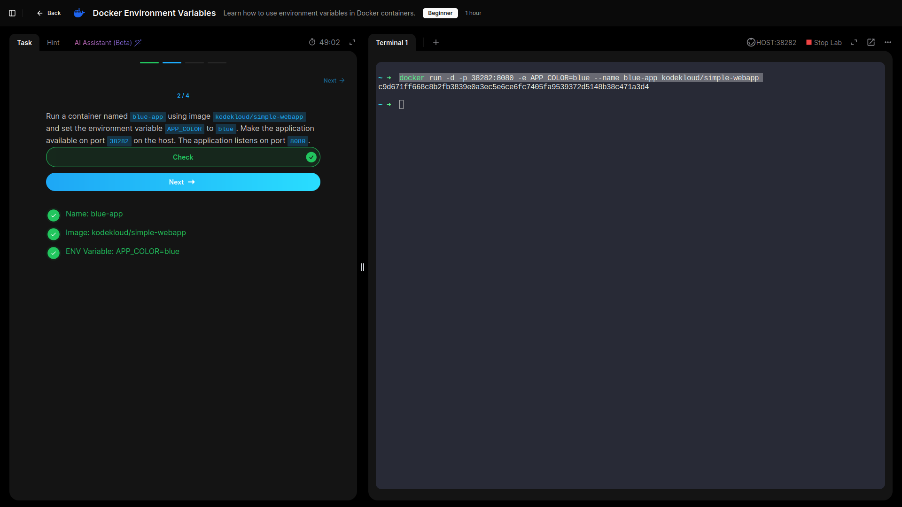
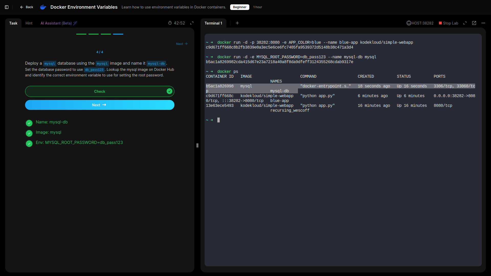
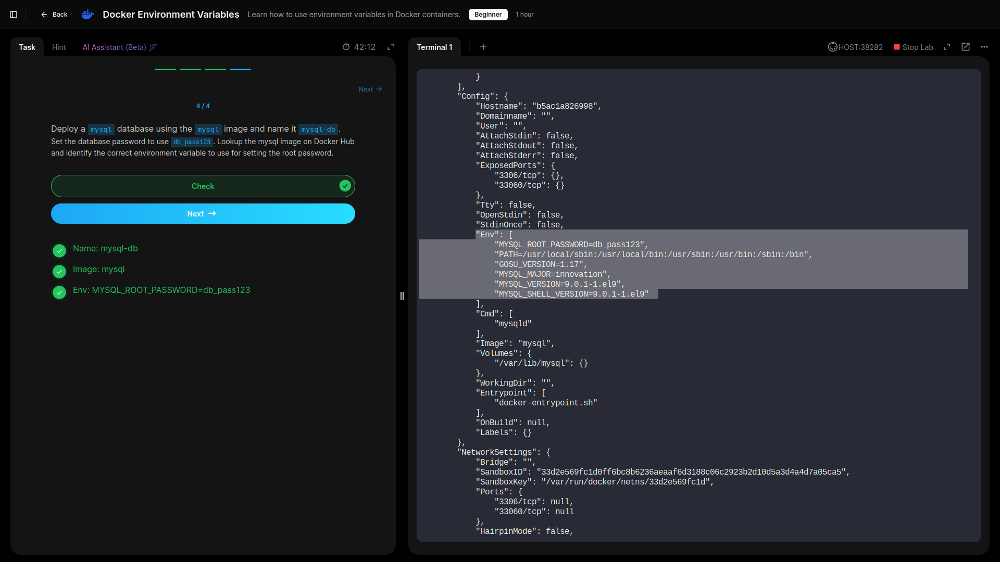

# Docker Environment Variables

## Learned how to use environment variables in Docker containers.

- **Inspected the environment variables set on the running container.**

- **Ran a container and specified environment variables.**

- **Deployed a mysql database using the mysql image, and configured required environment variables.**

## Lessons Learned

- Gained experience inspecting environment variables in running containers to confirm correct values.  
- Learned how to set custom variables (e.g., `APP_COLOR=blue`) at container startup and verify their impact through the application interface.  
- Practiced mapping host ports to container ports to make applications accessible externally.  
- Explored how official images like MySQL define their own required variables (such as the root password) and why referencing Docker Hub documentation is essential.  

### GRC Reflection
- Proper management of environment variables is critical for **security and compliance**:
  - Secrets such as database passwords should be stored securely (e.g., using secrets managers) instead of being hard-coded.
  - Consistent variable naming aids **auditability** and **configuration governance**.

