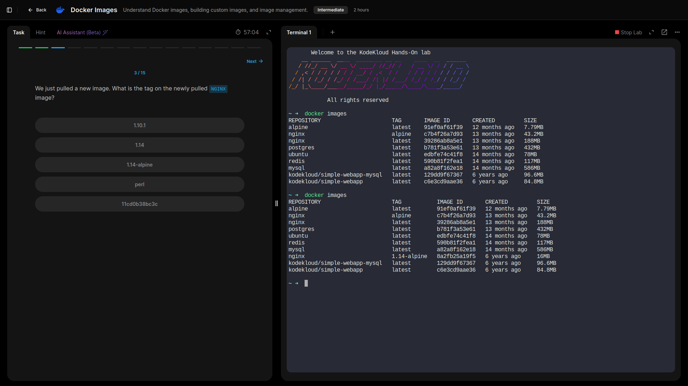
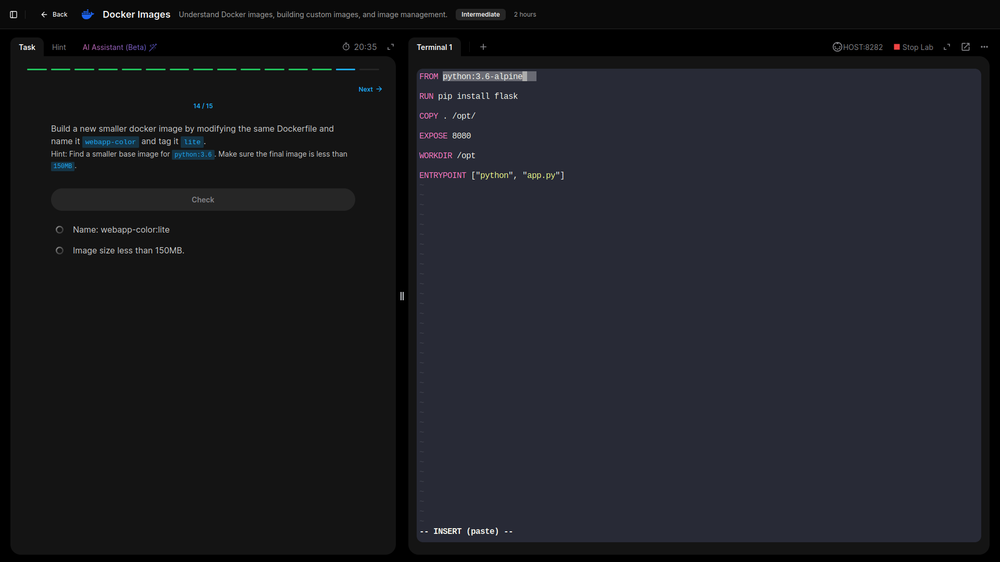

# Images

## Understand Docker images, building custom images, and image management.

---

- **Checked images available on host.**

- **Inspected `Dockerfile` on host.**

- **Build an image using the `Dockerfile`.**

- **Ran instance of the image and accesed the application.**

- **Checked base Operating System used by the `python:3.6` image.**
  

- **Checked the approximate size of the `webapp-color` image.**
  

- **Built a new smaller docker image by modifying the same Dockerfile and named it webapp-color and tagged it lite.**
  

- **Ran an instance of the new image webapp-color:lite and published port 8080 on the container to 8383 on the host.**
  

---

## Lessons Learned 

- Reviewed images stored locally and compared their sizes to understand storage impact.  
- Inspected the provided Dockerfile to see how application layers and dependencies are defined.  
- Built a custom image (`webapp-color`) and ran it with host-to-container port mapping for external access.  
- Identified the base operating system used by the official `python:3.6` image, reinforcing the need to know upstream dependencies.  
- Measured the size of the custom image and optimized it by creating a lighter variant (`webapp-color:lite`), illustrating how small changes in a Dockerfile can reduce image size and improve efficiency.  

## GRC Insight:
Tracking image sources, base OS details, and size reductions is critical for governance and risk management—ensuring images remain secure, lightweight, and auditable throughout their lifecycle.

