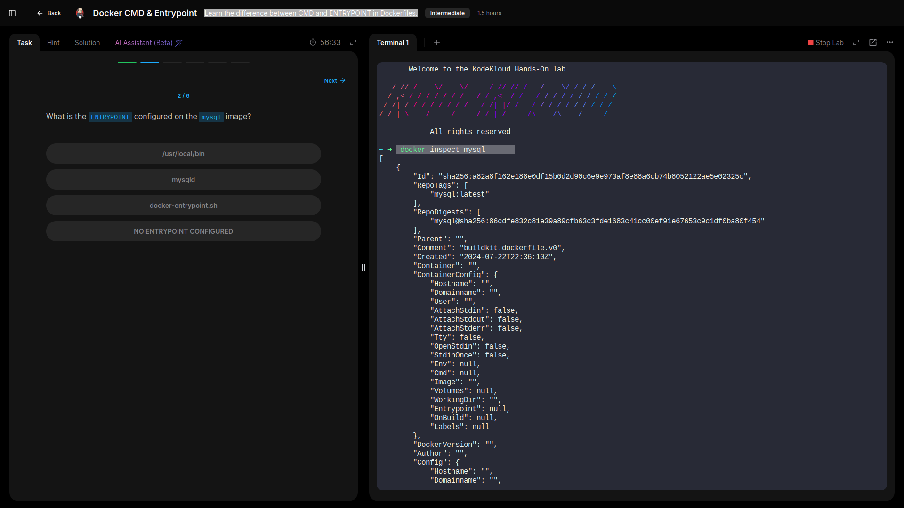
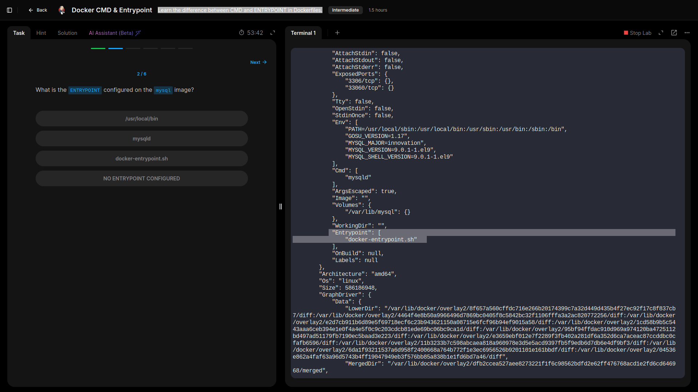
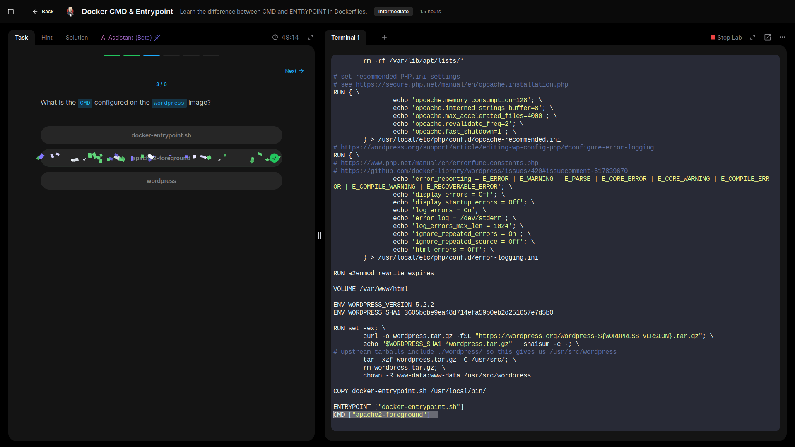
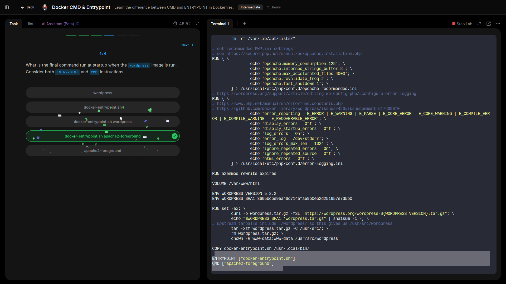
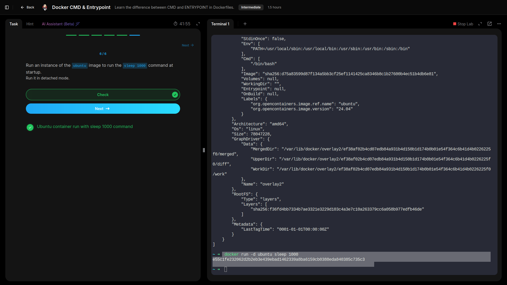

# CMD and Entrypoint

## Learned the difference between CMD and ENTRYPOINT in Dockerfiles.

---

- **Inspected `Entrypoint` configured on an image.**

- **Inspected `CMD` configured, and command run at startup on an image.**

- **Ran an instance of the `ubuntu` image to run the `sleep 1000` command at startup.**

---

## Lessons Learned 

- Examined how an image’s **ENTRYPOINT** defines the primary executable that always runs when a container starts.  
- Reviewed how **CMD** provides default arguments or commands that can be overridden at runtime.  
- Observed how CMD and ENTRYPOINT interact, and how combining them allows default behavior with flexibility for custom parameters.  
- Practiced overriding the default startup by running an Ubuntu container with a custom command (`sleep 1000`) to keep the container running.

## GRC Insight:  
Clear, well-documented startup commands reduce operational risk. Consistent ENTRYPOINT/CMD definitions help ensure containers launch with expected behavior, supporting auditability and reliable, compliant deployments.

