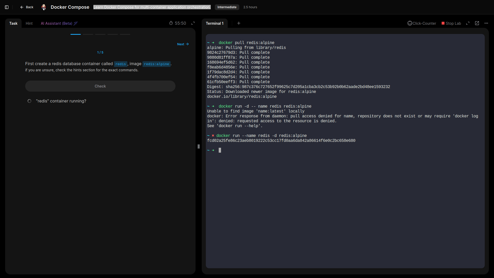
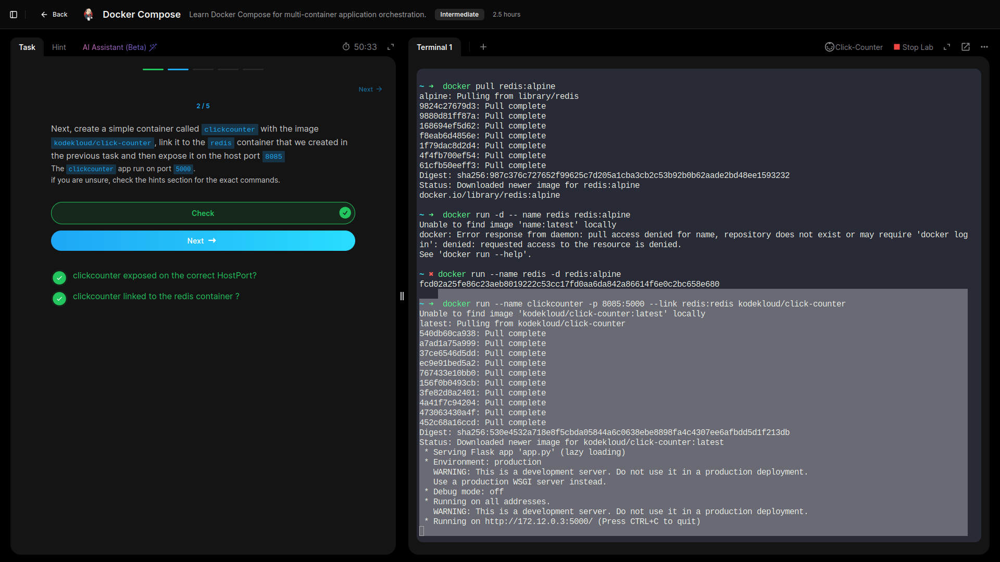
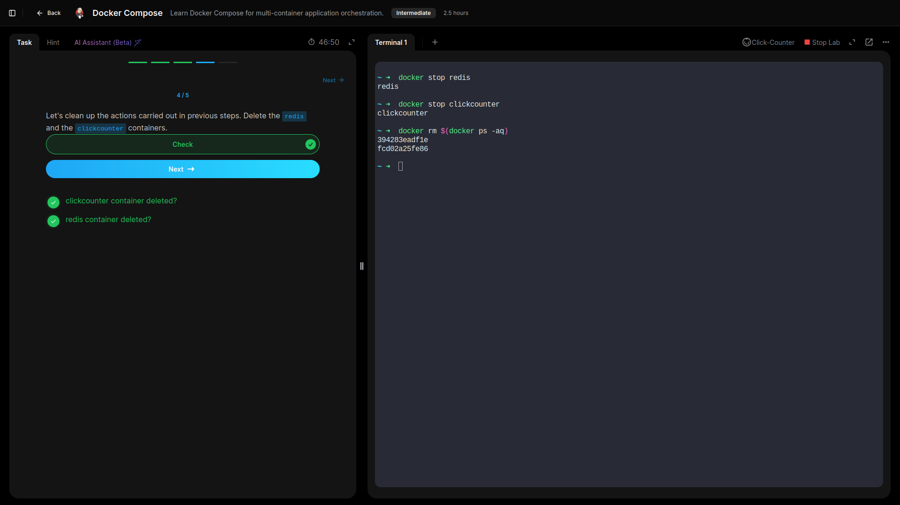
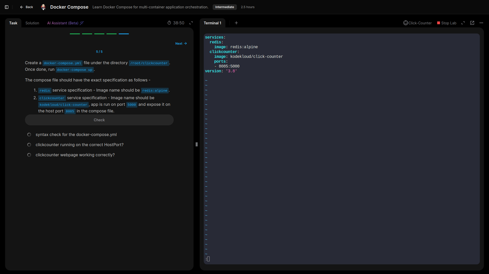
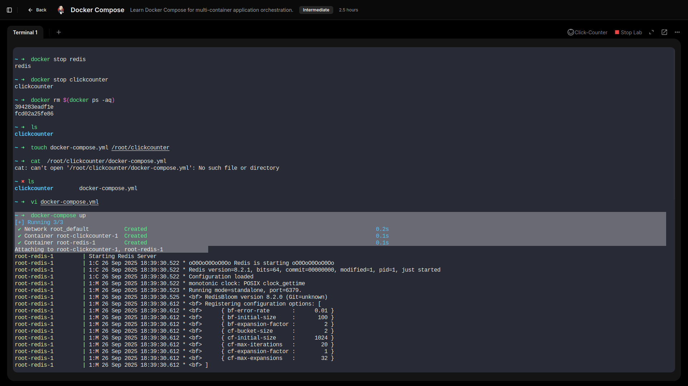
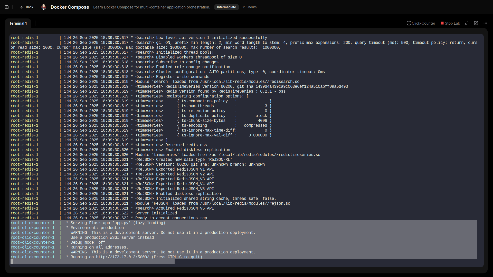

  # Docker Compose 

  ## Learned Docker Compose for multi-container application orchestration.

  ---

  - **Created a redis database container called `redis`, image `redis:alpine`.**

- **Created a simple container called clickcounter with the image `kodekloud/click-counter`, link it to the redis container that we created in the previous task and then expose it on the host port `8085`.**

- **Deleted previously created containers**

- **Created a `docker-compose.yml` file under the directory `/root/clickcounter.` and, ran `docker-compose up.`**

- **Accessed clickcounter webpage.**

---

## Lessons Learned 

- Deployed multiple services—**Redis** and **Clickcounter**—together, first manually and then using a `docker-compose.yml` file for repeatable automation.  
- Linked the Clickcounter container to Redis, exposing the web app on host port **8085** while it runs internally on **5000**.  
- Practiced cleaning up by removing individual containers before switching to a compose-based workflow.  
- Wrote a `docker-compose.yml` to define both services, showing how a single file can manage configuration, networking, and startup.

## GRC Insight:
Compose files serve as **infrastructure-as-code**, enabling version control, peer review, and compliance audits. Clearly defined services and ports support secure, predictable deployments and governance of multi-container applications.
