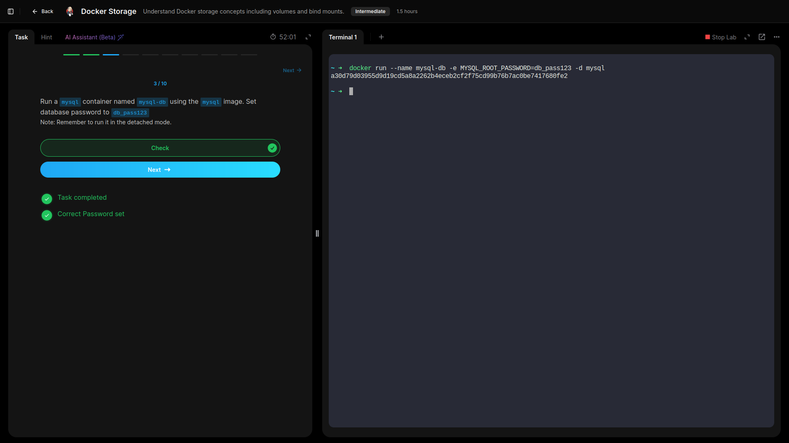
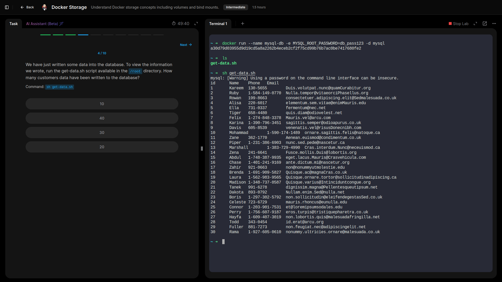
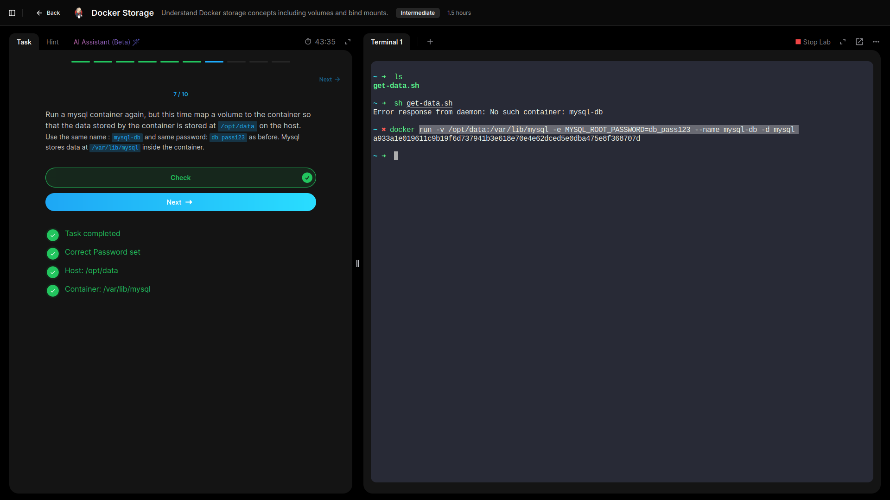
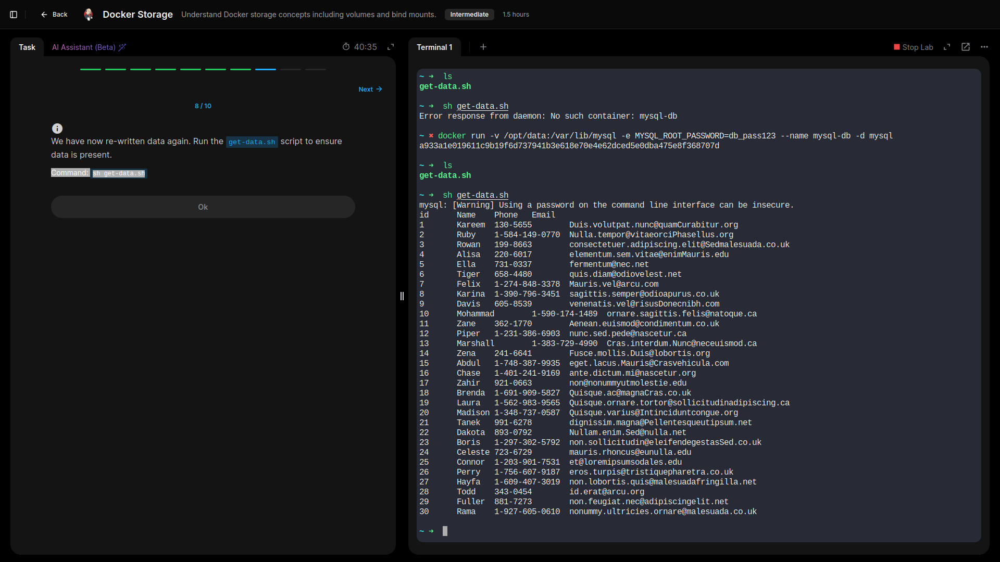

# Storage

## Understood Docker storage concepts including volumes and bind mounts.

---

- **Ran a `mysql` container named `mysql-db` using the `mysql` image. Set database password to `db_pass123`.**

- **Viewed data written onto database.**

- **Database crushed, ran another container but this time mapped a volume to the container.**

- **Ensured data was present by running script in the `/root` directory uisng command: `sh get-data.sh`.**

---

## Lessons Learned 

- Deployed a MySQL container with a set root password and confirmed data creation by running a validation script.  
- Observed that data written to a container is ephemeral unless persistent storage is configured.  
- Re-ran the MySQL container with a host volume mapped to `/opt/data`, ensuring MySQL’s internal data directory (`/var/lib/mysql`) persisted across container restarts or removals.  
- Verified data integrity by checking that the customer records remained available after redeployment.

## GRC Insight:
Persistent volumes are critical for **data durability, compliance, and auditability**. Mapping host storage allows backups, access control, and adherence to retention policies—key aspects of governance and risk management.

