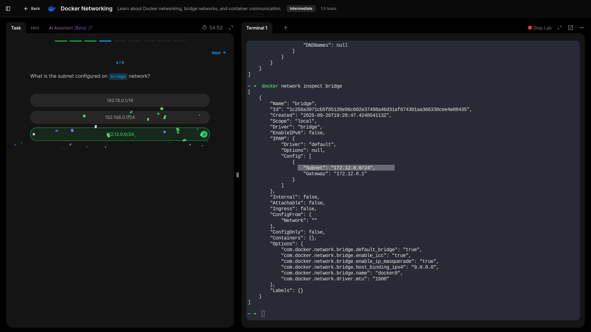
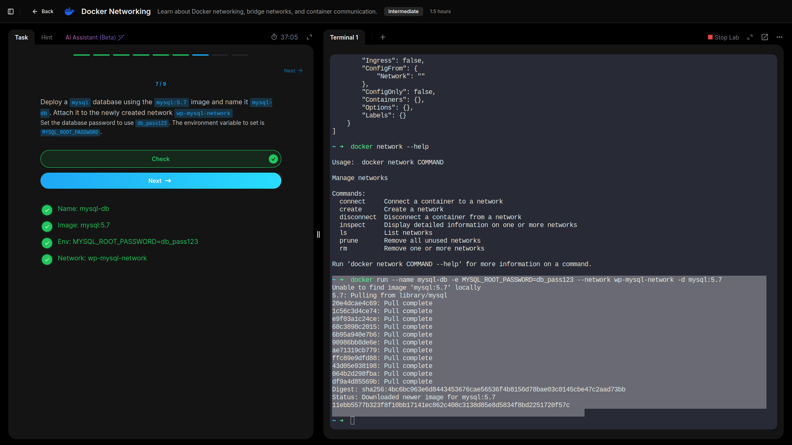

# Networking

## Learned about Docker networking, bridge networks, and container communication.

---

- **Explored the current setup and identified the number of networks that exist on the system.**

- **Identified network attached to a container.**

- **Inspected subnet configured on a network.**

- **Ran a container named `alpine-2` using the `alpine` image and attached it to the `none` network.**

- **Created a new network named `wp-mysql-network` using the `bridge` driver. Allocated subnet `182.18.0.0/24.` Configure Gateway `182.18.0.1.`**

- **Deployed a mysql database using the `mysql:5.7` image and name it `mysql-db`. Attached it to the newly created network `wp-mysql-network`.**

- **Deployed a web application named webapp using the kodekloud/simple-webapp-mysql image, exposed the container’s port 8080 to port 38080 on the host, also made use of two environment variable:**
  
- 1: DB_Host with the value mysql-db.
- 2: DB_Password with the value db_pass123.
- **Made sure to attach it to the newly created network called wp-mysql-network.**

---

## Lessons Learned – Docker Networking Lab

- Explored existing Docker networks, identified their types, and confirmed which networks active containers were using.  
- Reviewed details of the default **bridge** network, including its configured subnet.  
- Practiced running a container (`alpine-2`) on the **none** network to observe isolation from external connectivity.  
- Created a custom bridge network `wp-mysql-network` with a defined subnet (182.18.0.0/24) and gateway (182.18.0.1), reinforcing control over IP addressing.  
- Deployed a MySQL database and a web application on this custom network, ensuring secure communication and correct environment variable configuration for database connectivity.  
- Published the web app on host port **38080** to verify end-to-end connectivity.

## GRC Insight:
Custom networks allow **segmentation and controlled communication**, reducing attack surface and aiding compliance with network security policies. Explicit subnets and gateways support auditability and predictable network governance.

