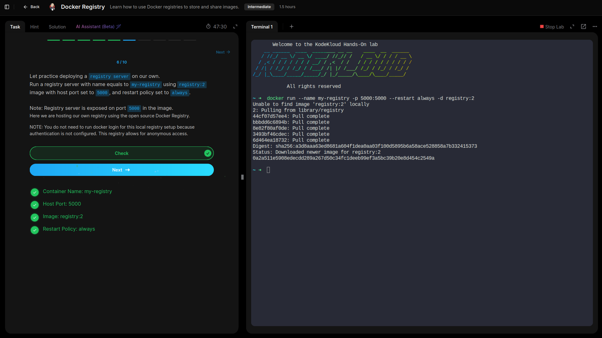
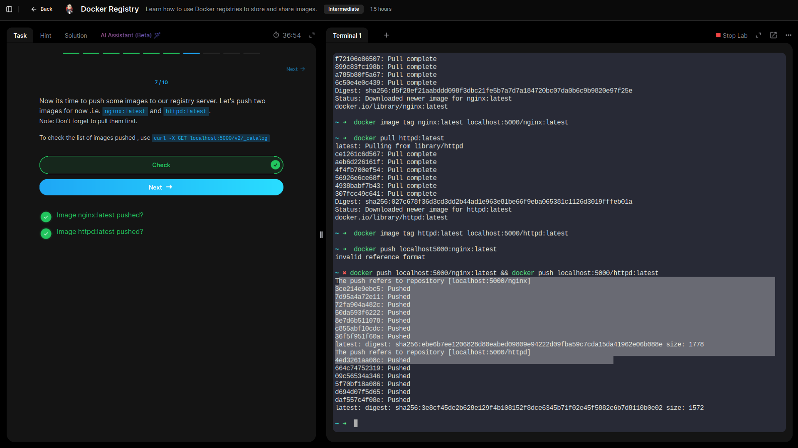
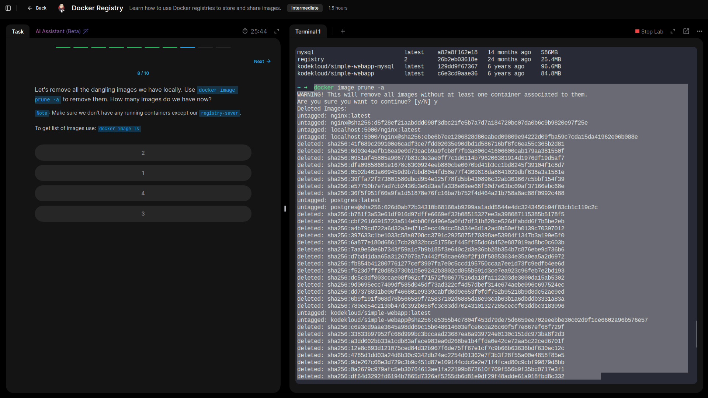

# Registry

## Learned what a docker registry is and how to use Docker registries to store and share images.

---

- **Practised deploying a registry server.** 

- **Pulled,tagged, and pushed some images to our newly created registry server.**

- **Removed all dangling images locally using command `docker image prune -a`.**

## Lessons Learned – Docker Registry Lab

- Understood the purpose of a **Docker registry** as a central service for storing and distributing container images.  
- Reviewed how Docker Engine interacts with **Docker Hub** by default and how other self-hosted registries can be used.  
- Practiced deploying a private registry container (`my-registry`) using the `registry:2` image, exposing it on host port **5000** with a persistent restart policy.  
- Logged in and pushed locally built images to the private registry, confirming image distribution beyond Docker Hub.  
- Cleaned up the environment by removing dangling images to free space and maintain a tidy local image cache.

## GRC Insight:  
Running a private registry enhances **supply-chain security and compliance** by allowing control over image sources, access permissions, and vulnerability scanning, ensuring only approved images are used in production.
